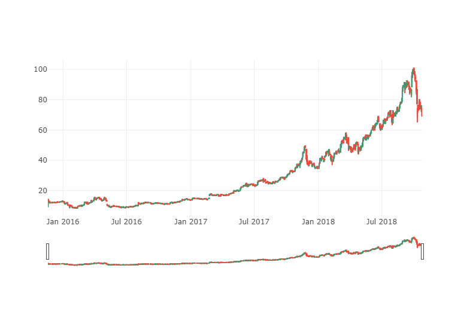
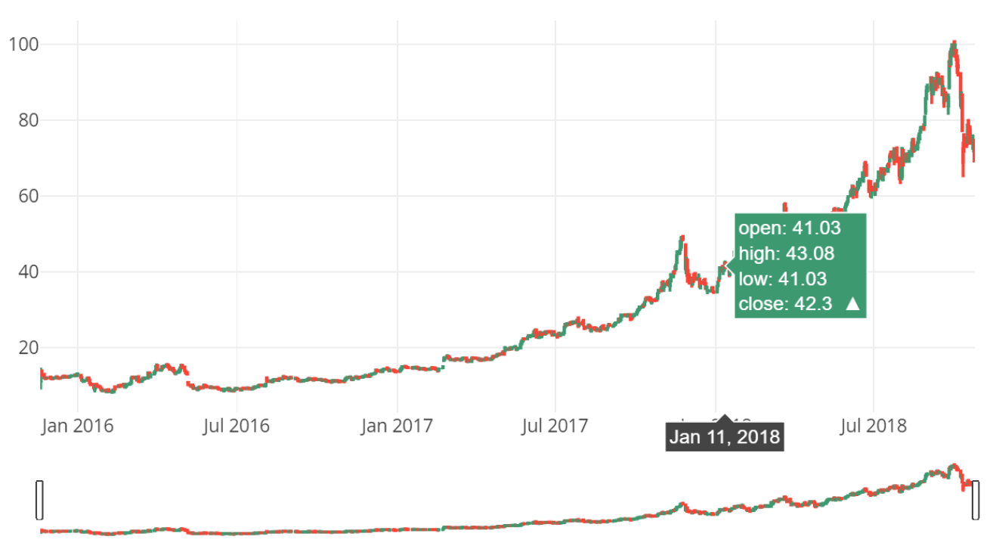
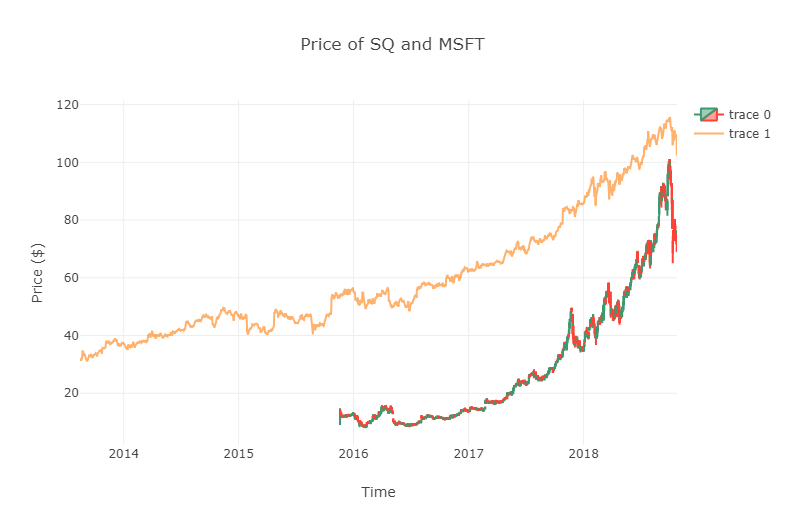
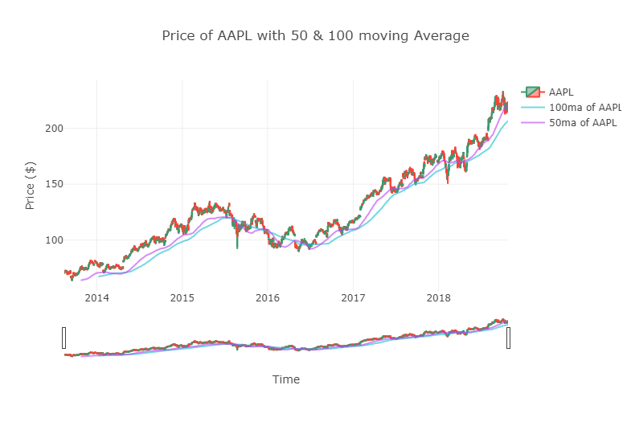
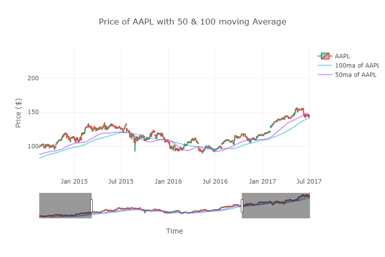
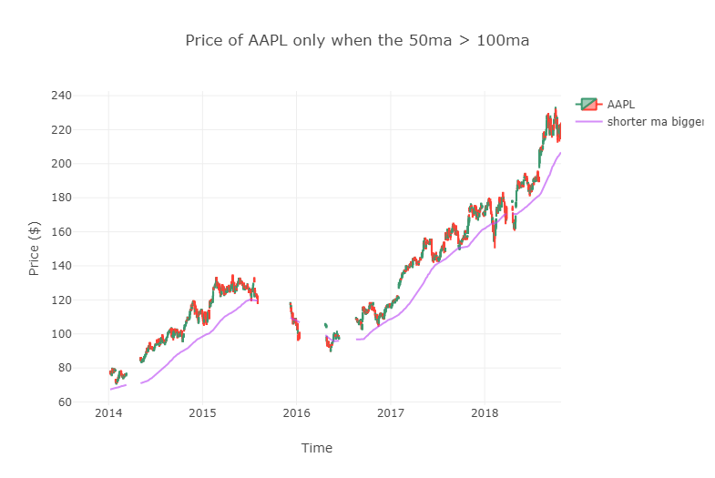
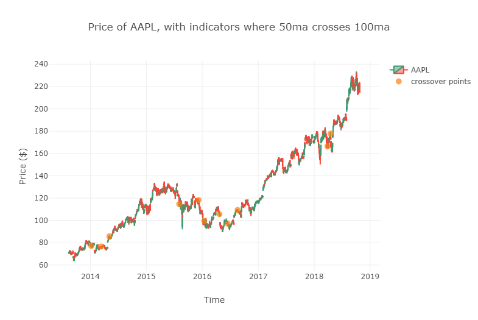
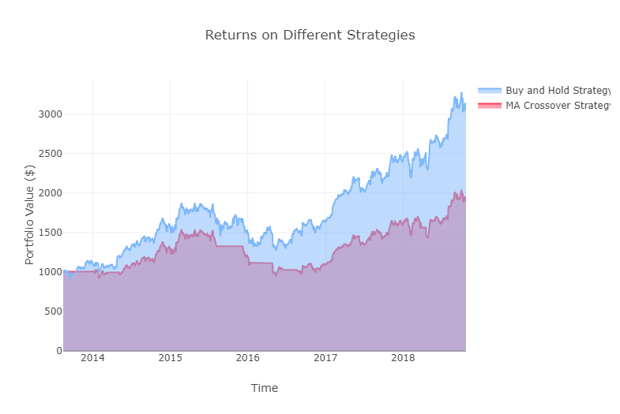

# Moving-Average-Chart-Plotly
This is a python test of a trading strategy using moving average crossovers. What this program does is it calculates the 50 day Moving Average and the 100 day moving average of a stock, finds when the crossovers happen, and then buy and sell based on those indicators. This strategy's indicators are called the "Death Cross" and the "Golden Cross" because of their strong ability to indicate the beginnings of a bear and bullish market. An HTML file is provided for interactive charts.

### Death Cross and Golden Cross:
A cross is made from two different moving averages. A shorter moving average, calculated based on a shorter time frame, and a longer moving average, with a longer time frame than the shorter. Common pairs of short and long term moving averages are 100 and 200, 50 and 100, and also 20 and 50.

A **Death Cross** in particular is when the shorter moving average dips below the price of the longer moving average. This is a strong indication that a selloff is happening.

A **Golden Cross** is when the shorter moving average moves above the price of the longer moving average. This indicates that the stock price will likely increase. 

In this particular example, the moving averages that are being used are the 50 day and the 100 day moving average. 

## Notes
The backtest that I made in this example was not very routine. I could have optimized it better. But the results were fine though. I also only backtested on one stock, so this wasn't a good test on the strategy in general.

Below are some pictures of charts created.

*some charting practice, no strategy in place*

  
  

  
  

*charting the 50 day and 100 day moving averages on the graph*

  
  
  

*plotting AAPL on the areas where you should hold*

*plotting AAPL with indicators where crossover happens*

*chart of returns with the crossover strategy versus a buy and hold strategy*

